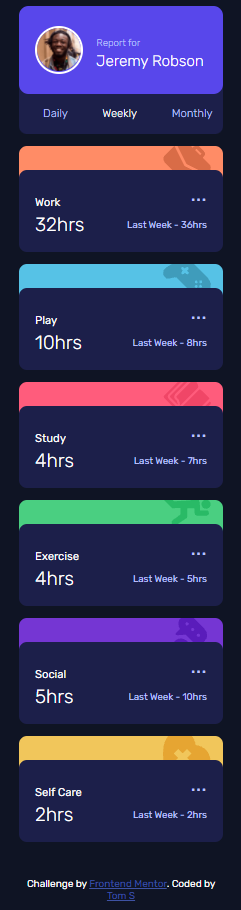
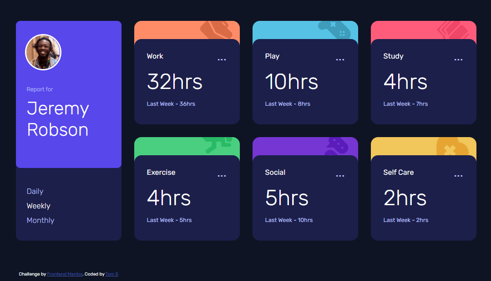

# Frontend Mentor - Time tracking dashboard solution

This is a solution to the [Time tracking dashboard challenge on Frontend Mentor](https://www.frontendmentor.io/challenges/time-tracking-dashboard-UIQ7167Jw). Frontend Mentor challenges help you improve your coding skills by building realistic projects. 

## Table of contents

- [Overview](#overview)
  - [The challenge](#the-challenge)
  - [Screenshot](#screenshot)
  - [Links](#links)
- [My process](#my-process)
  - [Built with](#built-with)
  - [What I learned](#what-i-learned)
  - [Continued development](#continued-development)
- [Author](#author)
- [Acknowledgments](#acknowledgments)

## Overview

### The challenge

Users should be able to:

- View the optimal layout for the site depending on their device's screen size
- See hover states for all interactive elements on the page
- Switch between viewing Daily, Weekly, and Monthly stats

### Screenshot
- Mobile

- Desktop

### Links

- Solution URL: [Time Tracking Dashboard](https://github.com/Tom-S82/fm-time-tracking-dashboard.git)
- Live Site URL: [Time Tracking Dashboard](https://your-live-site-url.com)

## My process

### Built with

- Semantic HTML5 markup
- CSS custom properties
- Flexbox
- CSS Grid
- Mobile-first workflow
- Javascript Async data calls

### What I learned

- More confidence with CSS Grid
- More confidence with using CSS `nth-child` functionality

### Continued development
- Javascript async (needed a lot of StackOverflow)
- CSS (a lot of transforms to get everything to line up)

## Author
- Frontend Mentor - [@Tom-S82](https://www.frontendmentor.io/profile/Tom-S82)